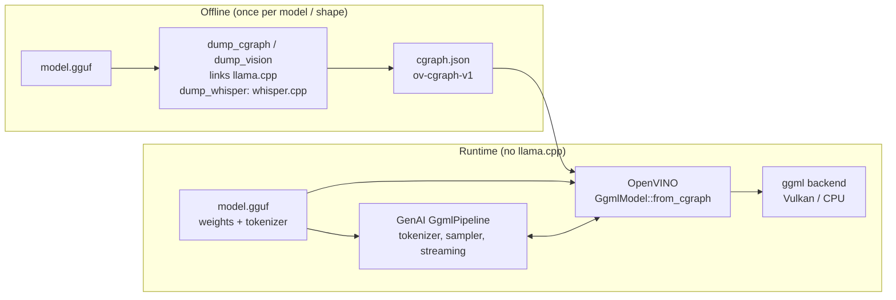

# ggml cgraph flow: llama.cpp graph → OpenVINO → OpenVINO GenAI

> This document is mirrored, unchanged, in all three repositories below.

Run GGUF models on a ggml backend (Vulkan, CPU, ...) with OpenVINO GenAI providing the
tokenizer, chat template, sampler and streaming. The model's compute graph is captured
**offline** from llama.cpp and replayed by OpenVINO; llama.cpp is a dump-time tool only and is
never loaded at runtime.

| Repository | Branch | Role | Needs llama.cpp? |
|---|---|---|---|
| [ynimmaga/ggml-cgraph-generator](https://github.com/ynimmaga/ggml-cgraph-generator) | `main` | Dumps a model's `ggml_cgraph` to a JSON artifact (`ov-cgraph-v1`) | Yes, at dump time |
| [ynimmaga/openvino](https://github.com/ynimmaga/openvino/tree/ggml_cgraph_loader) | `ggml_cgraph_loader` | `openvino_ggml_cgraph_loader`: rebuilds the artifact as a ggml graph and executes it (`GgmlModel`) | No |
| [ynimmaga/openvino.genai](https://github.com/ynimmaga/openvino.genai/tree/ggml_cgraph_loader) | `ggml_cgraph_loader` | `GgmlPipeline` / `GgmlVLMPipeline`: GenAI generation loop over `GgmlModel` | No |



The artifact holds **topology only** (ops, shapes, strides, op params, data flow). Weights are
read from the original `.gguf` at load time, so the artifact is small (~200–500 KB) and the
`.gguf` is still required at runtime.

---

## 1. Prerequisites

- **Dump time:** a built llama.cpp checkout. `dump_vision` also needs `libmtmd`
  (built by default with `LLAMA_BUILD_TOOLS=ON`).
- **Runtime:** ggml from [ggml-org/ggml](https://github.com/ggml-org/ggml) (the standalone
  project, not llama.cpp's vendored copy). Either let the OpenVINO build fetch it, or install
  it yourself and point OpenVINO at it with `-Dggml_DIR`.
- **Vulkan backend:** Vulkan drivers, plus `glslc` if OpenVINO fetches and builds ggml
  (`apt install glslc` or the Vulkan SDK).
- The usual OpenVINO / OpenVINO GenAI build requirements (CMake, Ninja, a C++17 compiler).

## 2. Dump the graph — ggml-cgraph-generator

```sh
git clone https://github.com/ynimmaga/ggml-cgraph-generator.git
cd ggml-cgraph-generator
LLAMA_CPP_DIR=/path/to/llama.cpp ./build.sh        # -> dump_cgraph, dump_vision
```

Text decoder, single token per forward pass (the one every pipeline needs):

```sh
./dump_cgraph model.gguf decoder_b1.json 256        # 256 = KV context size baked in
```

Optional extra artifacts:

```sh
# Batched prefill buckets (same model, same n_kv; one artifact per token count)
N_TOKENS=4 ./dump_cgraph model.gguf decoder_b4.json 256
N_TOKENS=8 ./dump_cgraph model.gguf decoder_b8.json 256

# VLM: vision tower + an embedding-input text decoder
./dump_vision mmproj.gguf text-model.gguf vision.json 512
DUMP_VLM_DECODER=1 ./dump_cgraph text-model.gguf vlm_decoder.json 256
```

Speech recognition (whisper.cpp model, not llama.cpp — build with `WHISPER_CPP_DIR` set, see the
generator README):

```sh
# -> whisper.encoder.json, whisper.decoder.json, whisper.gguf (weights + whisper.* metadata)
./dump_whisper ggml-base.bin whisper
```

Every artifact is **shape-static**: valid only for the `(n_tokens, n_kv)` (or image size `px`)
it was dumped with. See the generator README for all flags and the artifact format.

## 3. Build OpenVINO with the cgraph loader

```sh
git clone -b ggml_cgraph_loader https://github.com/ynimmaga/openvino.git
cd openvino && git submodule update --init --recursive
cmake -B build -G Ninja -DCMAKE_BUILD_TYPE=Release \
      -DENABLE_GGML_CGRAPH_LOADER=ON \
      -Dggml_DIR=/path/to/ggml-install/lib/cmake/ggml   # optional; omit to fetch ggml v0.23.0
ninja -C build
```

| CMake option | Default | Effect |
|---|---|---|
| `ENABLE_GGML_CGRAPH_LOADER` | `OFF` | Builds `openvino_ggml_cgraph_loader`; without it ggml is not fetched or linked |
| `ENABLE_GGML_VULKAN` | `ON` when the loader is on | Builds ggml's Vulkan backend (fetch path only; needs `glslc`). `OFF` = CPU backend only |
| `ggml_DIR` | unset | Use an installed ggml instead of fetching one. Its own build decides which backends exist |

Produces `bin/intel64/Release/libopenvino_ggml_cgraph_loader.so` and the public header
`src/ggml_cgraph_loader/include/openvino/ggml_cgraph_loader/ggml_model.hpp`. The header exposes
no ggml types, so consumers need no ggml headers.

## 4. Build OpenVINO GenAI with the ggml pipelines

```sh
git clone -b ggml_cgraph_loader https://github.com/ynimmaga/openvino.genai.git
cd openvino.genai && git submodule update --init
cmake -B build -G Ninja -DCMAKE_BUILD_TYPE=Release \
      -DOpenVINO_DIR=/path/to/openvino/build \
      -DENABLE_GGML_PIPELINE=ON \
      -DOV_GGML_CGRAPH_LOADER_ROOT=/path/to/openvino \
      -DENABLE_PYTHON=OFF -DENABLE_JS=OFF -DENABLE_SAMPLES=OFF -DENABLE_TESTS=OFF
ninja -C build openvino_genai
```

`OV_GGML_CGRAPH_LOADER_ROOT` locates the loader's header and library, which are not exported
through `find_package(OpenVINO)`. `OV_GGML_CGRAPH_LOADER_LIB_DIR` overrides the library directory.

## 5. Run

If OpenVINO was built against an **installed** ggml (`-Dggml_DIR`), put its libraries on the
loader path; the fetched-ggml build places them next to OpenVINO's libraries and does not need this:

```sh
export LD_LIBRARY_PATH=/path/to/ggml-install/lib
```

The backend is chosen automatically (discrete GPU, then integrated GPU, then CPU) or by name
(`"Vulkan0"`, `"CPU"`).

### 5a. Text generation — `GgmlPipeline`

```cpp
#include "openvino/genai/ggml_pipeline.hpp"

ov::genai::GgmlPipeline pipe("decoder_b1.json", "model.gguf", /*backend=*/"");
ov::genai::GenerationConfig cfg;
cfg.max_new_tokens = 32;
auto res = pipe.generate("The capital of France is", cfg);
std::cout << res.texts[0] << "\n";

// Streaming
pipe.generate("Tell me a story.", cfg, [](std::string s) {
    std::cout << s << std::flush;
    return ov::genai::StreamingStatus::RUNNING;
});
```

Tokenizer and chat template come from the `.gguf`. Sampling (temperature, top-k/top-p/min-p,
penalties, stop strings, seeded multinomial) is GenAI's own `Sampler`.

### 5b. Batched prefill — bucketed `GgmlPipeline`

```cpp
std::vector<std::pair<size_t, std::filesystem::path>> buckets = {
    {1, "decoder_b1.json"}, {4, "decoder_b4.json"}, {8, "decoder_b8.json"}};
ov::genai::GgmlPipeline pipe(buckets, "model.gguf", "");
```

A size-1 bucket is required (decode is single-token). Prefill uses the smallest bucket that fits
the remaining prompt and pads unused rows into a reserved KV slot. Output is identical to the
single-bucket pipeline.

### 5c. Vision-language — `GgmlVLMPipeline`

```cpp
#include "openvino/genai/ggml_vlm_pipeline.hpp"

ov::genai::GgmlVLMPipeline pipe("vision.json", "mmproj.gguf", "vlm_decoder.json", "text-model.gguf");
ov::Tensor image(ov::element::u8, ov::Shape{H, W, 3});   // interleaved RGB
// ... fill image ...
auto res = pipe.generate("What is in the image?", image, cfg);
```

Image preprocessing (resize + normalize) is reimplemented in GenAI using
`clip.vision.image_size` / `image_mean` / `image_std` from the mmproj's GGUF metadata.

### 5d. Speech recognition — `GgmlWhisperPipeline`

```cpp
#include "openvino/genai/ggml_whisper_pipeline.hpp"

ov::genai::GgmlWhisperPipeline pipe("whisper.encoder.json", "whisper.decoder.json", "whisper.gguf");
std::vector<float> audio = ...;              // 16 kHz mono, [-1, 1] -- same as WhisperPipeline
auto cfg = pipe.get_generation_config();     // token ids / lang_to_id come from the model
cfg.language = "<|en|>";                     // optional; detected when unset
cfg.task = "transcribe";                     // or "translate"
auto res = pipe.generate(audio, cfg);        // res.texts[0], res.language
```

Log-mel features come from GenAI's `WhisperFeatureExtractor`; the vocabulary and special tokens
come from the `.gguf`, so no OpenVINO tokenizer model is involved. Greedy decoding, no timestamps.

### 5e. Driving `GgmlModel` directly (no GenAI)

```cpp
#include "openvino/ggml_cgraph_loader/ggml_model.hpp"
using ov::ggml_cgraph_loader::GgmlModel;

auto model = GgmlModel::from_cgraph("decoder_b1.json", "model.gguf", "");
// per step: write inputs, compute, read logits
model->write_input("inp_tokens", &token, sizeof(int32_t));
model->write_input("inp_pos", &pos, sizeof(int32_t));
// ... inp_out_ids, every inp_kv_idx*, every self_kq_mask* ...
model->compute();
std::vector<float> logits(model->logits_size());
model->read_logits(logits.data());
```

Link with `-lopenvino -lopenvino_ggml_cgraph_loader`. llama.cpp auto-names most graph inputs, so
the loader identifies each input by the op that consumes it and publishes a canonical name:

| Input | Type | Meaning |
|---|---|---|
| `inp_tokens` | i32 | Token ids, one per row |
| `inp_pos` | i32 | Position of each row |
| `inp_kv_idx`, `inp_kv_idx_1` | i64 | KV cache slot each row is written to (one per cache; write every name starting with `inp_kv_idx`) |
| `self_kq_mask*` | f16 | Attention mask, `0` = visible, `-inf` (`0xFC00`) = masked. Size it with `input_size(name)` |
| `inp_out_ids` | i32 | Which rows produce logits |
| `embd` | f32 | Embedding input of a `DUMP_VLM_DECODER` graph |
| `inp_raw` | f32 | Preprocessed pixels of a vision-tower graph |
| `cache_*` | f16 | KV caches; zeroed at load, persist across `compute()` calls |
| `mel` | f32 | Whisper encoder input, `[n_mels][2 * n_audio_ctx]` log-mel frames |
| `embd`, `position`, `KQ_mask`, `inp_kv_idx` | i32, i32, f32, i64 | Whisper decoder inputs (llama.cpp-independent names, kept as whisper.cpp names them); `KQ_mask` is f32 `0` / `-inf` |

`input_names()` lists what a given artifact actually has; `write_input` returns `false` for an
absent name. Other accessors: `context_size()`, `output_size()`/`read_output()` (all rows, e.g. a
vision projector), `input_nbytes()`/`read_input()` (copy KV state between models),
`weight_nbytes()`/`read_weight()` (raw `.gguf` tensor rows), `gguf_meta_i32()`/`gguf_meta_f32_array()`/
`gguf_meta_i32_array()`/`gguf_meta_u8_array()`/`gguf_meta_str_array()`.

## 6. Limitations and known issues

- **Shape-static artifacts.** A different context size, batch size or image resolution needs a
  new dump.
- **`N_TOKENS >= 16` dumps are unusable.** When Vulkan is a candidate backend at larger batches,
  ggml's scheduler inserts repacked-weight copies (`Vulkan0#blk.N...#0`) that the dumper records as
  `.gguf` weights; loading fails. Buckets 1, 4 and 8 are fine.
- **Bucketed prefill performance.** Faster for prefill in isolation, but an undiagnosed
  per-decode-step cost in the multi-bucket configuration cancels the gain after a few generated
  tokens. Output is correct either way.
- **VLM:** one image, single tile, no multi-turn KV retention. The prompt is built to SmolVLM's
  template shape rather than rendered from the model's Jinja template.
- **Whisper:** greedy decoding without timestamps; audio over 30 s is split into consecutive 30 s
  windows with no timestamp-driven seeking, so a word straddling a boundary can be lost.
  `initial_prompt`, `hotwords`, word timestamps are not implemented.
- **Not supported:** continuous batching, beam search, LoRA, paged KV cache.
- **Library path:** with an installed ggml (`-Dggml_DIR`), the loader has no runpath to it; set
  `LD_LIBRARY_PATH` as in section 5.

## 7. Verified configuration

Tested end to end on 2026-10-01 (Intel Graphics (PTL), Mesa Vulkan driver, `Vulkan0` backend):
generator cloned from GitHub and built against llama.cpp; OpenVINO `ggml_cgraph_loader` built
with `-DENABLE_GGML_CGRAPH_LOADER=ON` against an installed ggml; GenAI `ggml_cgraph_loader`
built against it.

| Test | Model | Result |
|---|---|---|
| `GgmlModel` directly, greedy | Llama-3.2-1B-Instruct Q4_0 | "…is Paris. The capital of Germany is Berlin. The capital of Italy is Rome." |
| `GgmlModel` directly, greedy | Qwen3-0.6B Q4_0 | Coherent ("…is Paris…") |
| `GgmlPipeline`, `{1}` vs `{1,4,8}` buckets | Llama-3.2-1B-Instruct Q4_0 | Identical text |
| `GgmlVLMPipeline`, real photo | SmolVLM-256M-Instruct F16 | "There is a black dog in the image." |
| `GgmlWhisperPipeline`, `samples/jfk.wav` (2026-10-06, CPU and `Vulkan0`) | whisper.cpp ggml-base (multilingual) | "And so my fellow Americans, ask not what your country can do for you, ask what you can do for your country." — identical to `whisper-cli`; language auto-detected `en`; CPU encoder output bit-exact with whisper.cpp |

Freshly dumped artifacts were byte-identical to earlier dumps, and every output matched the
previous development build exactly.
